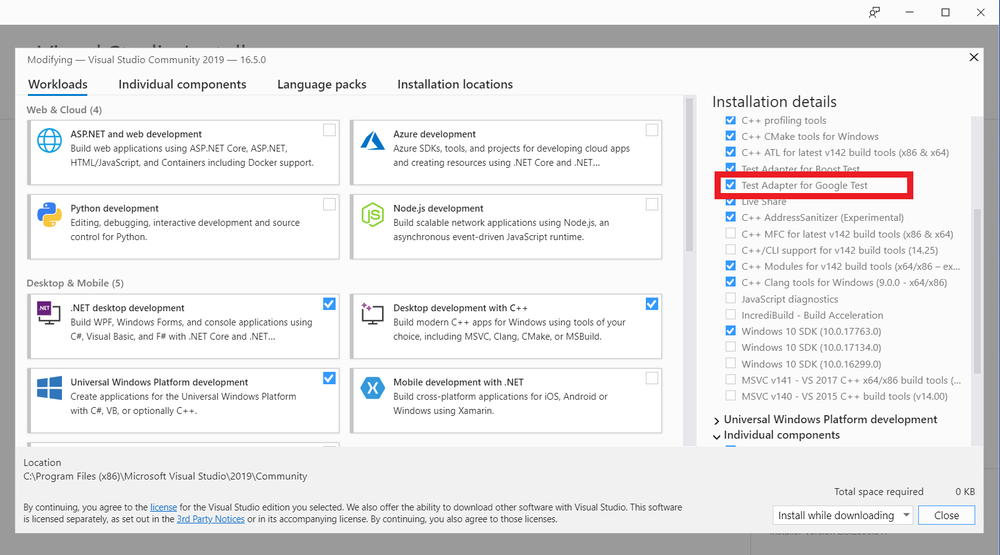

## Exercise: Unit Testing Essentials: Visual Studio and Google Test 

This exercise walks you through the basic structure of a Visual Studio solution that implements basic unit testing. While there are many ways to setup such a solution, the solution structure presented in this repository strikes a good balance between simplicity and scalability.

### Background

Google Test is a unit testing framework for native code that integrates with Visual Studio's builtin Test Explorer interface. However, unlike the Microsoft Unit Testing Framework, Google Test is not included in a default Visual Studio installation. However, this is easily addressed by modifying your Visual Studio installation.

Open the Visual Installer and _Modify_ your current installation. The only modification necessary to use Google Test is to ensure that the _Test Adapter for Google Test_ box is checked under the _Desktop Development with C++_ dropdown.

Performing this modification installs both the Google Test unit testing framework (a set of native libraries) and the Test Adapter for Google Test in Visual Studio.  

The solution in this exercise is composed of two projects. The `application` project simulates the primary application - this is the program that implements the functionality in which we are directly interested. In contrast, the `test` project is a distinct project with the sole purpose of implementing tests against functionality that is utilized in the primary application.

The `application` project is incredibly simple. It is composed of a primary source file, `main.cpp`, that contains the application's entry point and two other source files, `utils.cpp` and `utils.hpp` that simulate a set of utility routines that will be used by the main application. In larger projects, it is possible that such a set of utility functions would be pulled out of the `application` project and instead built as a separate static or dynamic library (depending on the deployment context) but for this exercise, the two source files are sufficient to illustrate the general unit testing principles.

The `test` project contains a single source file, `test.cpp`, that implements a unit test for the `factorial()` function defined in the `utils.cpp` file within the `application` project. In general, there are three steps to the setup of a project for unit testing against a distinct target project:

1. Add the necessary object files (or _.lib_ files in the event the utilities are implemented as a static library) to the linker inputs (_Properties_ -> _Linker_ -> _Inputs_ -> _Additional Dependencies_) for the target project. Do not use the full path to the object file or static library - only input the filename here. 
2. Add the intermediate build directory (or the final build directory in the event the utilities are implemented as a static library) of the target project to the linker's list of input directories (_Properties_ -> _Linker_ -> _General_ -> _Additional Library Directories_). This allows the linker to locate the object file or library identified in the previous step.
3. Add the source directory for the target project to the compiler's list of include directories (_Properties_ -> _C/C++_ -> _General_ -> _Additional Include Directories_). This allows the C/C++ compile to locate the headers that declare the functions under test from the primary application.

At this point, project setup is complete - you can `#include` the necessary headers in the test project and write tests against the functions declared therein. 

### Part 1: Solution Structure and Running Tests 

Build both the primary application and the test suite with _Build Solution_. Once the test suite is build, select _Test Explorer_ from the _Test_ menu in the topmost navigation bar. This opens up Visual Studio's Test Explorer which, because of Google Test's integration with Visual Studio, is able to automatically discover the tests defined in the `test` project. With the window open, select _Run All Tests_ in the top left of the Test Explorer window.

The test should fail, resulting in nasty looking red circles with white Xs propagating down the Test Explorer window.

Test Explorer displays the line on which the assertion that triggered the failure is located. Selecting this hyperlink takes you to the test file, allowing us to determine the nature of the failure which, in this case, appears to be a faulty implementation of the `factorial()` function in `utils.cpp`. Fix the implementation in `utils.cpp`, rebuild the test suite, and select _Run All Tests_ from the Test Explorer dropdown. The tests should now pass (provided your implementation is correct!) and you should be presented with green circles and white checkmarks all the way down the Test Explorer output window. 

**IMPT**: In some circumstances I have observed a rebuild of the test suite fail to result in a passing test even though I know the implementation to be fixed - as if the Test Explorer is caching the results of previous failed tests and not actually re-running them on demand. I have found that cleaning the entire solution and subsequently building from scratch addresses this issue.

### Part 2: Writing your own Test Suite

Part 1 presented the structure of a Visual Studio solution that implements unit testing. It did not, however, go through any of the specific of Google test and the specific functionalities that it provides. More details of the Google Test API are summarized concisely in the [Google Test Primer](https://github.com/google/googletest/blob/master/googletest/docs/primer.md) that is included in the project's Github repository.

For Part 2 of this exercise, your task is to implement a simple linked-list data structure and write a corresponding test suite that verifies that your implementation works as expected. You need not implement your linked-list in a static or dynamic library (library development is not the topic of this exercise) - implementing it directly in a console application project will suffice.

At a minimum, your linked-list implementation should support the following operations:

- Create
- Size / Count
- Insert 
- Remove
- Find / Lookup
- Destroy

Accordingly, your test suite should exercise each of these functionalities and verify that they work as expected. Consult the [Google Test Primer](https://github.com/google/googletest/blob/master/googletest/docs/primer.md) for a concise description of the test macros that Google Test makes available to you. The primary tools of interest will be:

- the `TEST()` macro
- the `EXPECT_EQ()` macro and its variants
- the `ASSERT_EQ()` macro and its variants

A Visual Studio Solution that implements the linked-list and its corresponding test suite is provided in the `reference` directory for your reference. The linked-list implementation in the reference project is thread-safe; this is not a requirement of your implementation (testing multithreaded code is another topic entirely). Furthermore, the tests provided in the reference implementation should by no means be considered exhaustive; the primary objective of this exercise is to force you to think critically about the tests you need to write in order to convince yourself that your implementation is correct, and only you can make this determination!