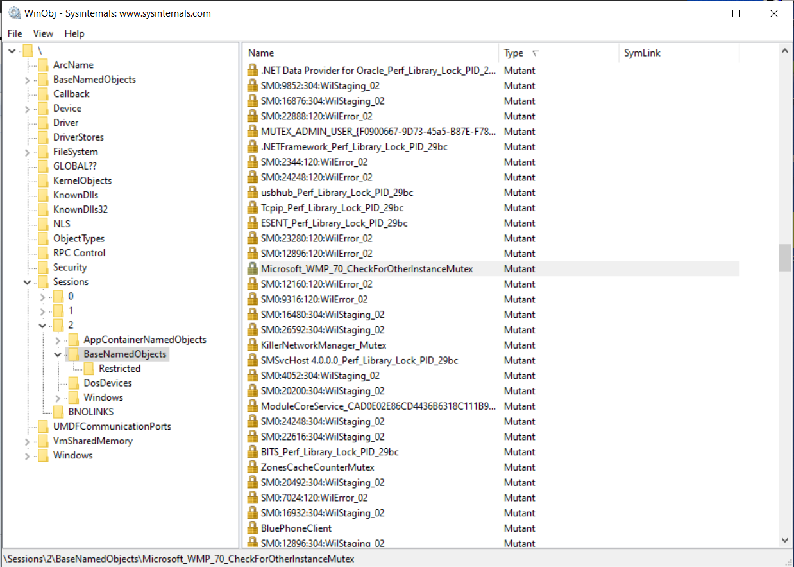

## Exercise: Application Single Instancing via Named Kernel Objects

This exercise explores a common application of named kernel objects - limiting applications to a single running instance.

### Background

Application single-instancing is a general practice by which a program limits itself to a single active process instance at a time. Normally, when you launch an executable (e.g. from the command line or by double-clicking the executable) a new instance of the program is spawned, but for applications that are single-instanced, subsequent requests to launch a second instance of the program will fail.

There are a number of strategies available to implement single-instancing, the most common of which is the use of named kernel objects. When the executable is launched, the first thing it does is create a named kernel object and determine if the kernel object existed prior to its own invocation of the create operation. If this is the case, the new instance concludes that there is an instance of itself already running and exits immediately.

The Windows Media Player application presents an archetypal example of single-instancing via named kernel objects. To see this process in action, launch an instance of Windows Media Player. Next, run an instance of the SysInternals _winobj_ tool (elevation is required). Within the `Sessions` directory, locate your current session (most likely session 1, although it might be a higher number) and navigate to the `Session\#\BaseNamedObjects` directory. There, after some scrolling, you will find an object with the name `Microsoft_WMP_70_CheckForOtherInstanceMutex` (the developers who wrote Windows Media Player were kind enough to make the kernel object name self-documenting) - this is the named kernel object that Windows Media Player uses to limit itself to a single active instance. 

With the first instance running, attempts to launch a second instance should fail and instead bring the existing instance to the foreground.

But enough about how Windows Media Player does it; its time to single-instance an application of your own.

### Procedure

Write a program that limits itself to a single active instance using named kernel objects. On startup, the program should use a named kernel object to determine if an instance of itself is already running and, if this is the case, exit immediately. Otherwise, the program, assured that it is the sole running instance, should simply wait indefinitely for user input (to keep the instance alive) and exit cleanly when this input is received.

Launch a couple instances of your application. Does your single-instancing strategy successfully prevent multiple instances from running simultaneously?

A sample application that meets these requirements is provided in the `reference/` directory; don't refer to the sample implementation until you have attempted the exercise yourself!